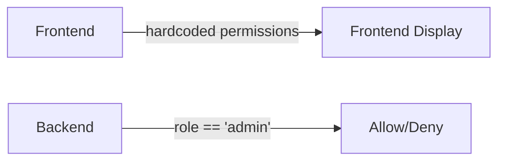
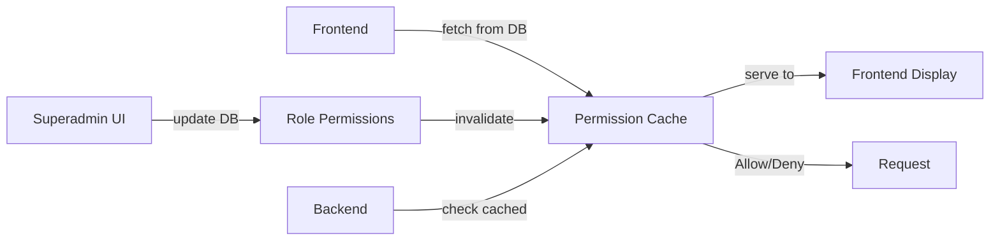

# Dynamic Permissions System Architecture

## Overview
A **hybrid permission system** where superadmin can dynamically configure role permissions at runtime, with defaults in code and overrides in the database.

---

## 1. Database Schema

### New Models (Prisma)

```prisma
// Role permissions - overrides for role permissions
model RolePermission {
  id              BigInt      @id @default(autoincrement())
  role_id         BigInt
  role            Role        @relation(fields: [role_id], references: [id], onDelete: Cascade)
  permission_name String      @db.VarChar(100)  // e.g., "Create Users", "Delete Data"
  is_granted      Boolean     @default(true)     // true = allowed, false = denied
  created_at      DateTime    @default(now())
  updated_at      DateTime    @updatedAt
  created_by      BigInt?
  created_by_user User?       @relation("PermissionCreatedBy", fields: [created_by], references: [id])
  
  @@unique([role_id, permission_name])
  @@map("role_permissions")
}

// Audit log for permission changes
model PermissionAuditLog {
  id              BigInt      @id @default(autoincrement())
  role_id         BigInt
  permission_name String      @db.VarChar(100)
  old_value       Boolean?    // Previous value
  new_value       Boolean     // New value
  changed_by      BigInt
  changed_by_user User        @relation(fields: [changed_by], references: [id])
  changed_at      DateTime    @default(now())
  reason          String?     @db.Text  // Why the change was made
  
  @@map("permission_audit_logs")
}

// Extend User model
model User {
  // ... existing fields ...
  permissions_created     RolePermission[]     @relation("PermissionCreatedBy")
  audit_logs_created      PermissionAuditLog[]
}

// Extend Role model
model Role {
  // ... existing fields ...
  permission_overrides    RolePermission[]
}
```

---

## 2. Permission System Flow

### Load Permissions (Startup)
```
1. Get all roles from DB
2. For each role:
   a. Cache default permissions (from frontend/code)
   b. Load DB overrides for that role
   c. Merge: DB overrides replace defaults
3. Cache merged permissions in memory
```

### Check Permission (Runtime)
```
User makes request → Load user.role → Get cached permissions for role → Check if permission granted → Allow/Deny
```

### Update Permission (Superadmin Action)
```
Superadmin clicks "Enable X for Y role" 
  → API: POST /api/permissions/{role_id}/{permission_name}
  → Update RolePermission in DB
  → Create AuditLog entry
  → Broadcast to all connected clients (WebSocket)
  → Update permission cache
  → All future requests use new permissions instantly
```

---

## 3. API Endpoints (Backend)

### 1. Get All Permissions for a Role
```
GET /api/admin/roles/{role_id}/permissions
Authorization: superadmin required
Response: {
  role_id: 1,
  role_name: "admin",
  permissions: {
    "Create Users": true,
    "Edit Users": true,
    ...
  }
}
```

### 2. Update Permission
```
PUT /api/admin/roles/{role_id}/permissions/{permission_name}
Authorization: superadmin required
Body: {
  is_granted: true/false,
  reason: "Removed delete access for guards"
}
Response: {
  role_id: 1,
  permission_name: "Delete Data",
  is_granted: false
}
```

### 3. Reset to Defaults
```
DELETE /api/admin/roles/{role_id}/permissions/{permission_name}
Authorization: superadmin required
→ Removes the override, reverts to default
```

### 4. Get Audit Log
```
GET /api/admin/permissions/audit-log?role_id=1&limit=50
Authorization: superadmin required
Response: [
  {
    role_name: "supervisor",
    permission_name: "Delete Data",
    old_value: null,
    new_value: false,
    changed_by: "reginedahan",
    changed_at: "2026-03-23T...",
    reason: "Security policy update"
  },
  ...
]
```

---

## 4. Frontend Components

### SuperAdmin Dashboard
```
┌─────────────────────────────────────┐
│  Permission Management              │
├─────────────────────────────────────┤
│ Role: [Admin▼]                      │
│                                     │
│ Permissions:                        │
│ ☑ Create Users        [Reset]      │
│ ☑ Edit Users          [Reset]      │
│ ☑ System Settings     [Reset]      │
│ ☐ Delete Data         [Reset]      │
│ ☑ Override Perms      [Reset]      │
│                                     │
│ [Audit Log]  [Create New Role]      │
└─────────────────────────────────────┘
```

### Audit Log Viewer
```
Date       | Role       | Permission      | Change | By          | Reason
-----------|------------|-----------------|--------|-------------|----------
23 Mar     | supervisor | Delete Data     | ON     | reginedahan | Security
22 Mar     | guard      | System Settings | OFF    | reginedahan | Policy
```

---

## 5. Implementation Checklist

### Phase 1: Database
- [ ] Create Prisma migrations for RolePermission & PermissionAuditLog
- [ ] Run migrations
- [ ] Seed default permissions (all roles get default set)

### Phase 2: Backend API
- [ ] Create `/api/admin/permissions/*` endpoints
- [ ] Add `require_superadmin_user_id` check to all endpoints
- [ ] Implement permission caching service
- [ ] Add WebSocket events for real-time permission updates

### Phase 3: Backend Permission Checking
- [ ] Create `check_permission(user_id, permission_name)` utility
- [ ] Update existing endpoints to use dynamic permission checks
- [ ] Remove hardcoded role checks

### Phase 4: Frontend
- [ ] Create PermissionManager component (superadmin only)
- [ ] Add to Settings page under superadmin tab
- [ ] Create AuditLogViewer component
- [ ] Real-time permission refresh on WebSocket events

### Phase 5: Testing & Refinement
- [ ] Test permission changes take effect instantly
- [ ] Verify audit logs are created correctly
- [ ] Test edge cases (user logged in when perms change, etc.)

---

## 6. Default Permissions (Hardcoded)

```javascript
// Used as fallback when no DB override exists
const DEFAULT_PERMISSIONS = {
  superadmin: {
    'Create Users': true,
    'Edit Users': true,
    'Archive/Restore Users': true,
    'Manage Cameras': true,
    'View Reports': true,
    'System Settings': true,
    'View Live Feed': true,
    'Delete Data': true,
    'Override Permissions': true,
    'Audit Logs': true,
  },
  admin: {
    'Create Users': true,
    'Edit Users': true,
    'Archive/Restore Users': true,
    'Manage Cameras': true,
    'View Reports': true,
    'System Settings': true,
    'View Live Feed': true,
    'Delete Data': false,
    'Override Permissions': false,
    'Audit Logs': false,
  },
  supervisor: { ... },
  guard: { ... },
  caregiver: { ... },
};
```

---

## 7. Key Implementation Details

### Permission Caching
```python
# server/src/services/permission_service.py
class PermissionCache:
    def __init__(self):
        self.cache = {}
        self.last_updated = {}
    
    async def get_permissions(role_id: int):
        # Check if cache is stale (older than 5 min)
        # If stale, reload from DB + merge with defaults
        # Return merged permissions
    
    async def invalidate(role_id: int):
        # Called when permission changes
        # Clear cache for this role
```

### Immediate User Updates
```javascript
// When superadmin changes permission
// 1. API updates DB ✓
// 2. WebSocket broadcasts event to all clients
socket.on('permissions_updated', (data) => {
  // data = { role_id: 1, permissions: {...} }
  // Update user context if user.role matches role_id
  // Force re-check of component visibility
});
```

---

## Migration Path

### Before (Current)


### After (Dynamic)


---

## Benefits

✅ **Runtime Configuration** - No code redeploy to change permissions
✅ **Audit Trail** - Know who changed what and when  
✅ **Flexibility** - Superadmin can create custom roles
✅ **Real-Time** - Changes apply instantly to all users
✅ **Safe Defaults** - Code defaults fall back if DB empty
✅ **Scalable** - Works with new roles added later

---

## Next Steps

Ready to implement? I recommend starting with:
1. **Database migrations** (creates tables)
2. **Permission caching service** (backend logic)
3. **API endpoints** (superadmin actions)
4. **Frontend permission manager** (UI)
5. **Real-time sync** (WebSocket)

Which phase would you like to start with?
